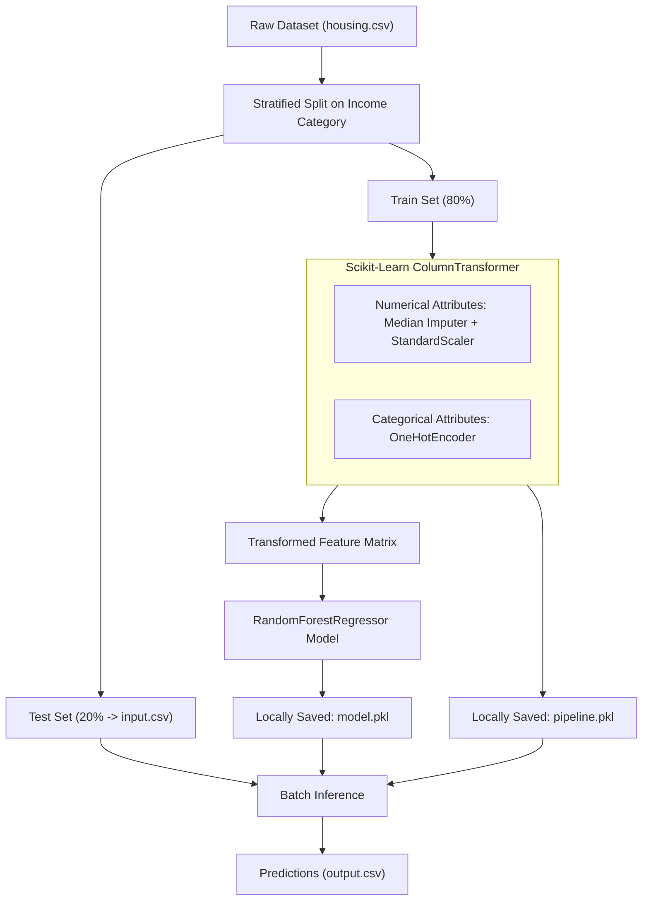

# 🏡 Housing Price Prediction Pipeline

[](https://www.python.org/)
[](https://scikit-learn.org/)
[](https://pandas.pydata.org/)
[](https://opensource.org/licenses/MIT)

An end-to-end Machine Learning pipeline designed to predict median house values from census and demographic data. Built with clean, production-ready Python architecture featuring automated data transformations, stratified train/test sampling, ensemble modeling (`RandomForestRegressor`), and seamless batch inference.

---

## 📌 Table of Contents

- [Overview](#-overview)
- [Key Features](#-key-features)
- [Pipeline Architecture](#-pipeline-architecture)
- [Repository Structure](#-repository-structure)
- [Dataset Details](#-dataset-details)
- [Quickstart Guide](#-quickstart-guide)
  - [1. Clone Repository](#1-clone-repository)
  - [2. Setup Virtual Environment](#2-setup-virtual-environment)
  - [3. Install Dependencies](#3-install-dependencies)
  - [4. Train the Model (Generates model.pkl)](#4-train-the-model-generates-modelpkl)
  - [5. Run Inference](#5-run-inference)
- [Command-Line Options](#-command-line-options)
- [Why `model.pkl` is not in this repository](#-why-modelpkl-is-not-in-this-repository)
- [Tech Stack](#-tech-stack)
- [License](#-license)

---

## 🚀 Overview

Predicting property values accurately requires systematic feature processing, handling of missing values, and preventing sampling bias. This repository contains a modular machine learning pipeline that:

1. Loads demographic and geographic census data.
2. Applies **Stratified Shuffle Sampling** on income categories to prevent dataset bias.
3. Builds an automated `ColumnTransformer` preprocessing pipeline:
   - **Numerical Features**: Median imputation for missing values + standard feature scaling.
   - **Categorical Features**: One-hot encoding with fallback for unseen categories.
4. Trains and evaluates a **Random Forest Regressor** ensemble.
5. Serializes model & preprocessing artifacts (`model.pkl` and `pipeline.pkl`) locally.
6. Executes batch inference on test inputs, saving predictions to `output.csv`.

---

## ✨ Key Features

- **Stratified Sampling**: Creates balanced training and test splits across representative median income brackets.
- **Robust Preprocessing**: Prevents data leakage by encapsulating imputation, scaling, and one-hot encoding into a unified `ColumnTransformer`.
- **Lightweight Repository**: Heavy model artifacts (>140 MB) are omitted from git tracking; you can train and recreate the model locally in seconds.
- **Production-Ready Architecture**: Clean modular functions, type hints, informative logging, and flexible command-line arguments via `argparse`.
- **Dual Inference Mode**: Automatically detects existing artifacts or allows explicit command-line controls for training and inference.

---

## 🏗️ Pipeline Architecture



---

## 📁 Repository Structure

```text
├── housing.csv          # Raw housing dataset
├── main.py              # Main pipeline script (train & predict CLI)
├── requirements.txt     # Python dependencies
├── .gitignore           # Excludes large binaries (model.pkl) & cache
└── README.md            # Comprehensive project documentation

Generated locally after running:
├── input.csv            # Test split created during training
├── output.csv           # Model predictions output
├── pipeline.pkl         # Fitted ColumnTransformer pipeline
└── model.pkl            # Trained RandomForest model weights (~140 MB)
```

---

## 📊 Dataset Details

The dataset contains housing and demographic statistics across various geographic districts:

| Feature | Type | Description |
|---|---|---|
| `longitude` | Float | Longitudinal coordinate of the block group |
| `latitude` | Float | Latitudinal coordinate of the block group |
| `housing_median_age` | Float | Median age of houses in the block |
| `total_rooms` | Float | Total count of rooms in the block |
| `total_bedrooms` | Float | Total count of bedrooms in the block (contains missing values) |
| `population` | Float | Total residents living within the block |
| `households` | Float | Total number of households / family units |
| `median_income` | Float | Median income of residents in tens of thousands USD |
| `ocean_proximity` | Categorical | Location relative to the coast (`<1H OCEAN`, `INLAND`, `NEAR OCEAN`, `NEAR BAY`, `ISLAND`) |
| **`median_house_value`** | **Float** | **Target Variable**: Median house price in USD |

---

## 🛠️ Quickstart Guide

### 1. Clone Repository
```bash
git clone https://github.com/<your-username>/<your-repo-name>.git
cd <your-repo-name>
```

### 2. Setup Virtual Environment
```bash
# Windows
python -m venv venv
.\venv\Scripts\activate

# Linux / macOS
python3 -m venv venv
source venv/bin/activate
```

### 3. Install Dependencies
```bash
pip install -r requirements.txt
```

### 4. Train the Model (Generates `model.pkl`)
Run training to build the preprocessing pipeline and train the model (takes ~20 seconds):
```bash
python main.py --mode train
```
This generates:
- `model.pkl` (Trained Random Forest model)
- `pipeline.pkl` (Fitted preprocessing ColumnTransformer)
- `input.csv` (Stratified test dataset for inference)

### 5. Run Inference
Generate predictions on `input.csv`:
```bash
python main.py --mode predict
```
The predicted house values will be exported to `output.csv`.

> **Tip**: Running `python main.py` without arguments uses **auto-mode**: it automatically trains if no model exists, or runs inference if the model is already present!

---

## ⚙️ Command-Line Options

| Flag | Default | Description |
|---|---|---|
| `--mode` | `auto` | Execution mode (`auto`, `train`, or `predict`) |
| `--data` | `housing.csv` | Filepath to raw training dataset |
| `--input` | `input.csv` | Filepath to input CSV for batch prediction |
| `--output` | `output.csv` | Destination filepath for prediction results |
| `--model` | `model.pkl` | Path to save/load trained model file |
| `--pipeline`| `pipeline.pkl` | Path to save/load preprocessing pipeline file |

---

## 💡 Why `model.pkl` is not in this repository

The trained Random Forest model (`model.pkl`) is approximately **140 MB**, which exceeds GitHub's 100 MB file limit. 

To keep this repository lightweight, clean, and fast to clone:
1. `model.pkl` is excluded via [`.gitignore`](.gitignore).
2. The entire training process is completely automated and reproducible.
3. You can generate your own fresh `model.pkl` anytime by running:
   ```bash
   python main.py --mode train
   ```

---

## 🛠️ Tech Stack

- **Language**: Python 3.8+
- **Machine Learning**: Scikit-Learn
- **Data Manipulation**: Pandas, NumPy
- **Serialization**: Joblib

---

## 📄 License

This project is licensed under the [MIT License](https://opensource.org/licenses/MIT).
